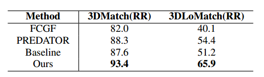
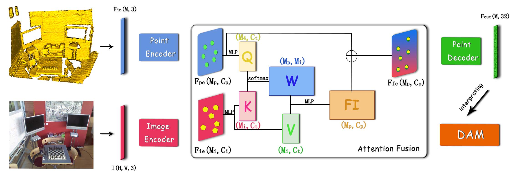
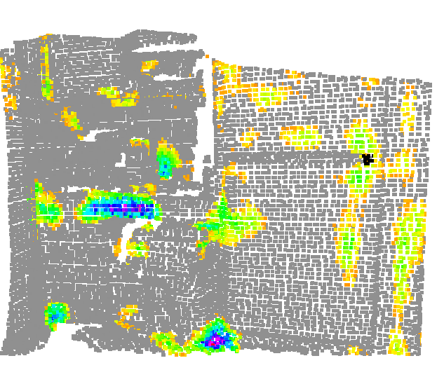
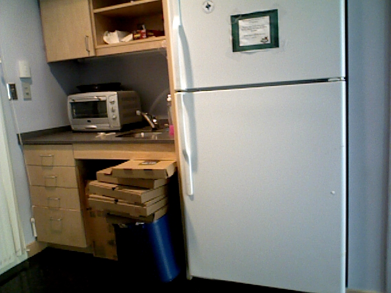

# IMFNet: Interpretable Multimodal Fusion for Point Cloud Registration, 2022

[](https://paperswithcode.com/sota/point-cloud-registration-on-3dmatch-benchmark?p=imfnet-interpretable-multimodal-fusion-for)

This repository is the implementation of [IMFNet: Interpretable Multimodal Fusion for Point Cloud Registration](https://arxiv.org/abs/2111.09624).

The existing state-of-the-art point descriptors relies on structure information only, which omit the texture information. However, texture information is crucial for our humans to distinguish a scene part. Moreover, the current learning-based point descriptors are all black boxes which are unclear how the original points contribute to the fnal descriptors. In this paper, we propose a new multimodal fusion method to generate a point cloud registration descriptors by considering both structure and texture information. Specifcally, a novel attention-fusion module is designed to extract the weighted texture information for the descriptors extraction. In addition, we propose an interpretable module to explain our neural network by visually showing the original points in contributing to the fnal descriptors. We use the descriptors’ channel value as the loss to backpropagate to the target layer and consider the gradient as the signifcance of this point to the fnal descriptors. This paper moves one step further to explainable deep learning in the registration task. Comprehensive experiments on 3DMatch, 3DLoMatch and KITTI demonstrate that the multimodal fusion descriptors achieves state-of-the-art accuracy and improve the descriptors’ distinctiveness. We also demonstrate that our interpretable module in explaining the registration descriptors extraction.

[Paper](https://arxiv.org/pdf/2111.09624.pdf)

## FMR vs. RR

|   FMR Table                     | RR Table                     |
|:-------------------------------:|:----------------------------:|
|         |       |

*Feature-match recall and Rigistration Recall in log scale on the 3DMatch benchmark.*


### The framework of IMFNet

The network architecture of the proposed IMFNet. The input is a point cloud and an image, and the output is a point descriptors. Inside the attention-fusion module, W is the weight matrix, FI is the point texture feature. Then, the fusion feature (Ffe) of point structure feature (Fpe) and point texture feature (FI) as an input to the decoder module to get the output descriptors. Final, the descriptors are interpreted by DAM.

|      The Overall Framework    | 
|:-----------------------------:|
|       |

Please refer to our [paper](https://arxiv.org/pdf/2111.09624.pdf) for more details.


### Visualization of DAM

Our DAM can visiualize the points contribution distribution of descriptor extraction.

|               IMFNet               |               FCGF               |
|:----------------------------------:|:--------------------------------:|
|         |         |
|       |       |

## Requirements

- Ubuntu 18.04.1 or higher
- CUDA 11.1 or higher
- Python v3.6 or higher
- Pytorch v1.8 or higher
- [MinkowskiEngine](https://github.com/stanfordvl/MinkowskiEngine) v0.5 or higher


## Dataset Download

Regarding the 3DMatch and 3DLoMatch, the images are selected for each point cloud based on their covered content to construct a dataset of paired images and point clouds named 3DImageMatch. Our experiments are conducted on this dataset. The dataset construction and training details are attached in the supplement material.
Download the [3DImageMatch/Kitti](https://pan.baidu.com/s/1GMYBth0fhid3IbbUJ0w1-Q) . The code is p2gl.

Please concat the files
```
# 3DImageMatch
cat x00 x01 ... x17 > 3DImageMatch
# Kitti
cat Kitti01 ... Kitti10 > Kitti
```

## Training

Train the 3DMatch

```
python train.py train_3DMatch.py
```

Train the Kitti

```
python train.py train_Kitti.py
```

## Evaluating

For benchmarking the trained weights, download the pretrain file [here](https://drive.google.com/file/d/1QsuvIt6qTlld-0klaADImkFEzCcuArbJ/view?usp=sharing) .
We also provide key points (5000) and some other results, [here](https://drive.google.com/drive/folders/1Pb9bkQefwgBfxcrrfUokiY7_EYv10dfD?usp=sharing)

Evaluating the 3DMatch or 3DLoMatch

```
# Generating Descriptors
python generate_desc.py --source <Testing Set Path> --target <Output Path> --model <CheckPoint Path>
# Evaluating 3DMatch
python evaluation_3dmatch.py --pcloud_root <Testing Set Path> --out_root <Output Path> --desc_types ['IMFNet'] --desc_roots ['<Descriptors Path>'] --benchmarks "3DMatch"
# Evaluating 3DLoMatch
python evaluation_3dmatch.py --pcloud_root <Testing Set Path> --out_root <Output Path> --desc_types ['IMFNet'] --desc_roots ['<Descriptors Path>'] --benchmarks "3DLoMatch"
```

Evaluating the Kitti

```
# Evaluating Kitti
python evaluation_kitti.py --save_dir <Output Path> --kitti_root <Testing Set Path>
```

## Descriptor Activation Mapping

Visualization the target descriptor

```
python dam.py --target <target point index>
```

## Citating our work

Please cite the following papers if you use our code:

```latex
@article{huang2021imfnet,
  title={IMFNet: Interpretable Multimodal Fusion for Point Cloud Registration},
  author={Huang, Xiaoshui and Qu, Wentao and Zuo, Yifan and Fang, Yuming and Zhao, Xiaowei},
  journal={arXiv preprint arXiv:2111.09624},
  year={2021}
}
```

 
